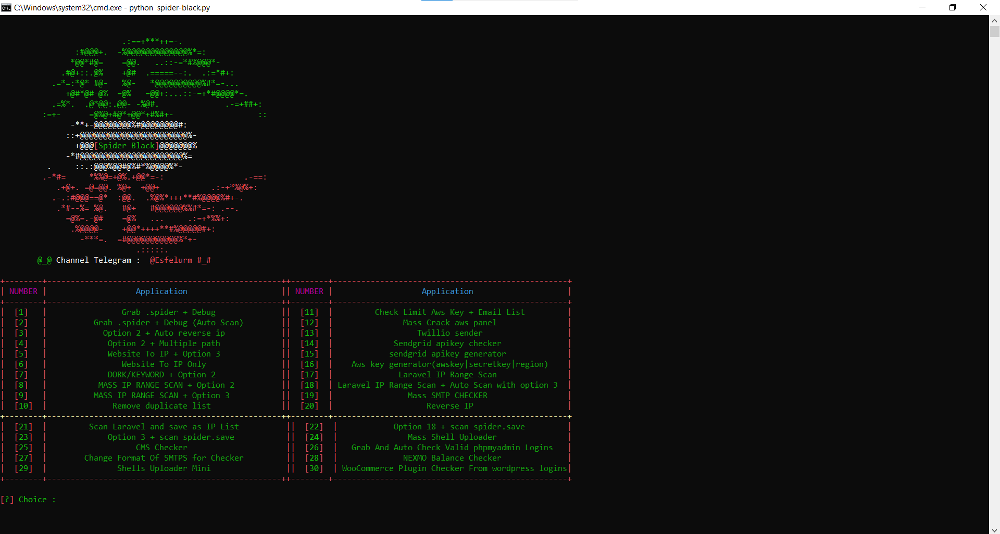
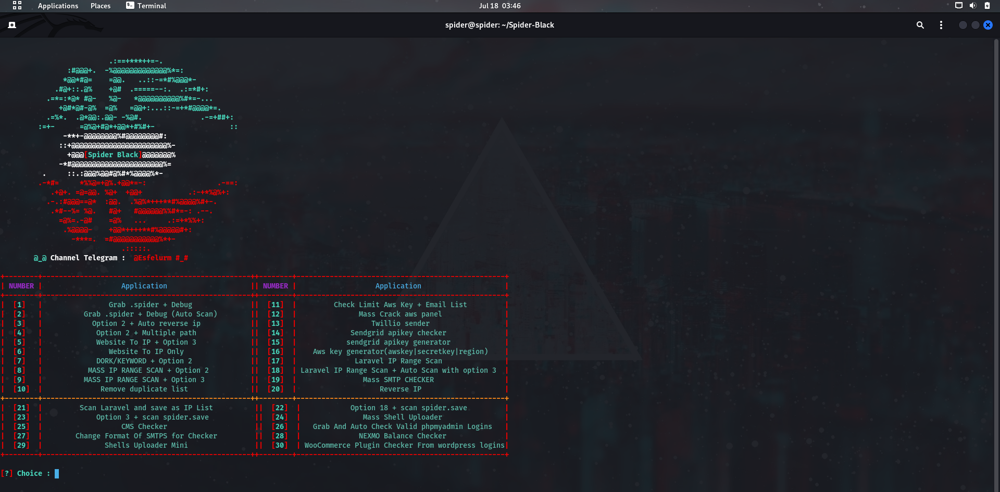

# Spider-Black
- A powerful and useful tool for web hacking enthusiasts

## Screenshot in Windows


## options

```
[+] Grab .spider + Debug 
[+] Aws key generator(awskey|secretkey|region)
[+] Grab .spider + Debug (Auto Scan)  
[+] Laravel IP Range Scan  
[+] Option 2 + Auto reverse ip 
[+] Laravel IP Range Scan + Auto Scan with option 3 
[+] Option 2 + Multiple path [with path.ini] 
[+] Mass SMTP CHECKER
[+] Website To IP + Option 3
[+] Website To IP Only          
[+] Reverse IP
[+] Scan Laravel and save as IP List 
[+] DORK/KEYWORD + Option 2  
[+] Option 18 + scan spider.save 
[+] MASS IP RANGE SCAN + Option 2 
[+] Mass Shell Uploader 
[+] Remove duplicate list   
[+] Grab And Auto Check Valid phpmyadmin Logins  
[+] Check Limit Aws Key + Email List 
[+] CMS Checker 
[+] NEXMO Balance Checker 
[+] Mass Crack aws panel(awskey|secretkey|region)    
[+] Twillio sender
[+] Change Format Of SMTPS for Checker
[+] Sendgrid apikey checker
[+] sendgrid apikey generator
[+] Shells Uploader Mini 
[+] WooCommerce Plugin Checker From wordpress logins
```
# install

```
git clone https://github.com/esfelurm/Spider-Black
cd Spider-Black
pip install -r requirements.txt
python spider-black.py
```
## screenshot in Linux


Channel Telegram : @esfelurm
